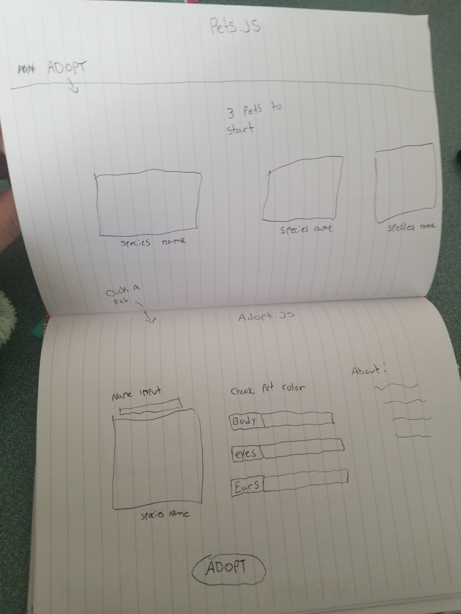
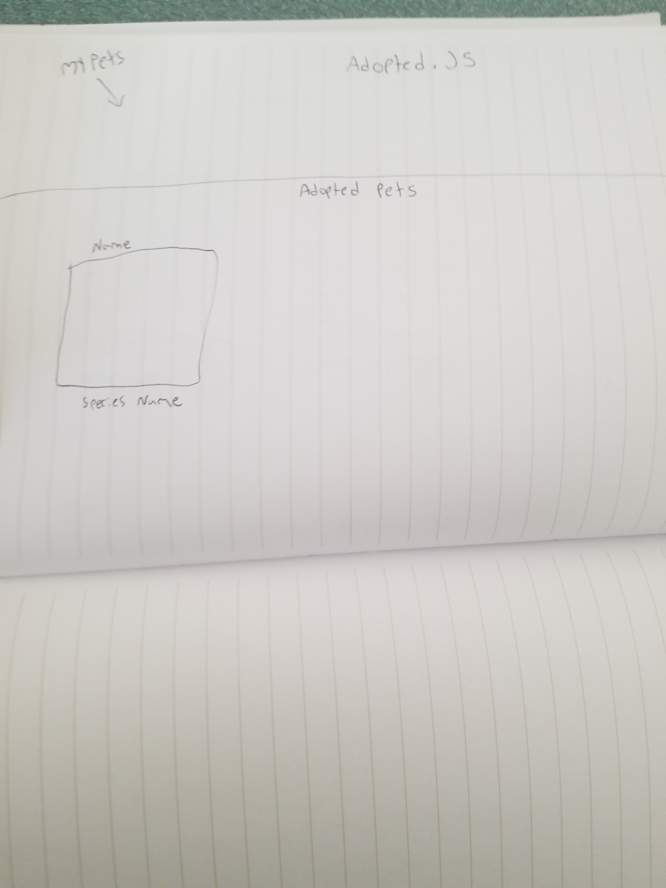

# L337 Pets
l337 Pets is a react app built with an Express backend. L337 Pets is based on Neopets, a popular website that lets you adopt a pet. The pets are bult with pure CSS and allow the user to adopt, name, and update the color of their chosen pet.

## App Screenshots

## Wireframes

## Installation

1. Fork and clone down the repository to your machine.
2. cd into the repo
3. Open in VScode by running code . in your terminal
4. Run npm i or npm install in your terminal
5. Run npm start in your terminal

## User Stories

### MVP

As a user, I want an app that renders in the browser
As a user, I want to be able to log into my own account
As a user, I want to be able to choose from 3 pets
As a user, I want to choose the color of my pets
As a user, I want to name my pet
As a user, I want a bio about each pet
As a user, I want to view my adopted pets

### Stretch Goals

As a user, I want to choose from more than 3 pets
As a user, I want to interact with my pets in other ways, like feeding them
As a user, I want my pets to be animated

### Major Hurdles

My biggest hurdle was working with pure CSS and getting my pets to render properly. I had to play around with the sizing and overall shape of the pets to get everything to look normal and not distorted. CSS can be very challenging to work with but I learned a lot.
